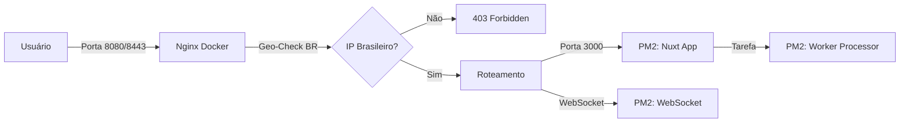

# Guia de Inicialização - PM2 e Nginx

Este guia detalha o novo fluxo para iniciar o projeto Gabarita AI combinando o **PM2** (para gerenciar os processos da aplicação) e o **Nginx** (como API Gateway e Restrição Geográfica).

## Arquitetura de Inicialização

Com a introdução do Nginx como API Gateway, o fluxo de inicialização mudou. O Nginx agora é a porta de entrada única (portas 80/443), e ele encaminha as requisições para os processos gerenciados pelo PM2.

### Componentes

1.  **Docker**: Gerencia a Infraestrutura (PostgreSQL) e o Geoblocking (Nginx).
2.  **PM2**: Gerencia a Aplicação (Nuxt, WebSocket e Worker).

---

## Fluxo de Inicialização (Simplificado)

Com a dockerização completa, você não precisa mais gerenciar o PM2 no host. Tudo é orquestrado pelo Docker.

### 1. Build e Inicialização Total
Execute um único comando para construir as imagens e subir todos os serviços (Banco, App/PM2, Nginx):
```bash
docker compose up -d --build
```
Este comando agora iniciará:
*   **Banco de Dados** (PostgreSQL)
*   **Nginx Gateway** (Com Geo-blocking)
*   **Aplicação Nuxt** (Via PM2-runtime dentro do Docker)
    *   **api**: Servidor Nuxt
    *   **websocket**: Servidor de WebSockets
    *   **worker-deck-processor**: Processador de PDFs

> [!NOTE]
> O PM2 gerencia internamente os 3 processos da aplicação dentro do container `gabarita_app`.

---

## Comandos Úteis

### Monitoramento
```bash
# Ver status de todos os containers
docker compose ps

# Ver processos do PM2 dentro do container
docker exec gabarita_app pm2 list

# Logs em tempo real de toda a stack
docker compose logs -f

# Logs específicos do App/PM2
docker compose logs -f app
```

### Reinicialização
```bash
# Reiniciar apenas os processos do PM2 (sem derrubar o container)
docker exec gabarita_app pm2 reload all

# Reiniciar o Nginx (após mudanças de regras de IP)
docker exec gabarita_nginx nginx -s reload
```

---

### Resumo do Fluxo de Requisições



# Acessar aplicação
# http://localhost:8080 (via Nginx)

## Configuração de Rede (Dica)

Para facilitar a comunicação entre o Nginx (Docker) e o PM2 (Host), você pode adicionar o host ao arquivo de configuração do Nginx ou usar a rede `host` no Docker se estiver no Linux.

Se o Nginx não encontrar o app, verifique o log de erro:
```bash
docker exec gabarita_nginx tail -f /var/log/nginx/error.log
```
